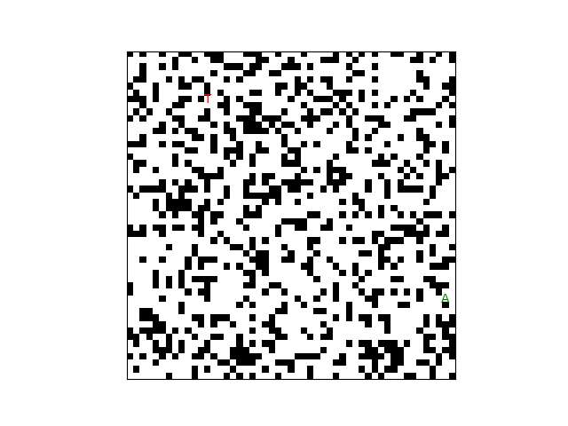
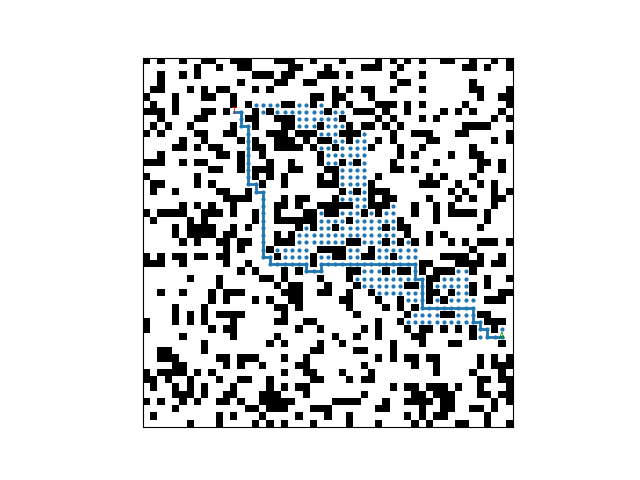
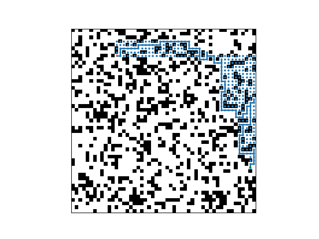
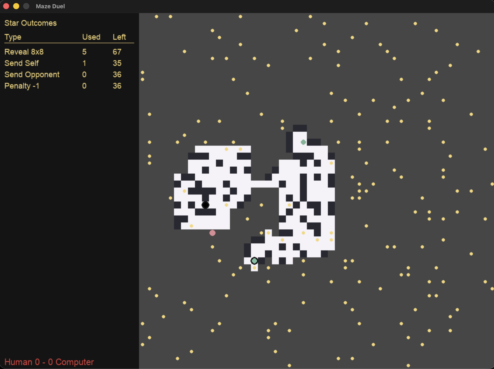

# Heuristic Search: A* Pathfinding Study & Maze Duel

An experimental study of A* search algorithms and an interactive game built from the same pathfinding implementation.

This project explores how different variants of A* behave when navigating partially known grid environments. The study compares standard A*, Repeated Forward A*, Repeated Backward A*, and Adaptive A*, including the effect of high-g and low-g tie-breaking strategies.

The project was later extended into **Maze Duel**, an interactive Pygame application in which a human player races an AI-controlled opponent through a partially observable maze. The computer player uses Adaptive A* to repeatedly plan its route as new obstacles are discovered.

## Algorithms Implemented

- **A*** — Standard A* search using Manhattan distance as the heuristic.
- **Repeated Forward A*** — Replans from the agent's current position as previously unknown blocked cells are discovered.
- **Repeated Forward A* (High-g vs. Low-g)** — Compares two tie-breaking strategies when nodes have equal f-values.
- **Repeated Backward A*** — Performs repeated searches in the reverse direction, from the goal toward the agent.
- **Adaptive A*** — Updates heuristic values using information learned during previous searches to improve subsequent replanning.

## Experimental Environment

The experiments use randomly generated grid worlds with:

- 51 × 51 cells
- 30% probability of blocked cells
- Four-directional movement
- Manhattan-distance heuristic
- Randomly selected unblocked start and goal positions

Randomly generated mazes are checked for a valid path between the start and goal before being accepted for simulation.

## Visualizing the Search Algorithms

The following examples show how different search strategies navigate the same randomly generated grid world.

### Generated Maze

### Standard A*

### Repeated Forward A* — High-g Tie-Breaking

### Adaptive A*

Additional visualizations for low-g Repeated Forward A* and Repeated Backward A* are available in the [`examples/`](examples/) directory.

## Experimental Measurements

The simulation framework can generate and evaluate multiple random grid worlds, allowing the search algorithms to be compared under the same environment assumptions.

For each search strategy, the program records:

- **Expanded nodes** — the number of states explored during search and replanning.
- **Path length** — the total length of the route taken through the grid.
- **Runtime** — execution time for the search process.
- **Failed mazes** — generated environments in which a valid solution is not produced.

These measurements make it possible to compare not only whether an algorithm reaches the goal, but also how much search effort is required to do so.

### Tie-Breaking

Repeated Forward A* is evaluated using both high-g and low-g tie-breaking when multiple nodes have the same f-value.

High-g tie-breaking favors nodes farther from the start, while low-g tie-breaking favors nodes closer to the start. Comparing the two demonstrates how a seemingly small implementation decision can substantially affect the number of states expanded during A* search.

### Adaptive Search

Adaptive A* uses information from previous searches to update heuristic estimates after replanning. For an expanded state `s`, the updated heuristic is based on:

`h(s) = g(goal) - g(s)`

This allows later searches to incorporate information learned during earlier searches rather than beginning each replanning step with only the original Manhattan-distance heuristic.

## Maze Duel: Interactive Adaptive A*

After completing the search experiments, the project was extended into **Maze Duel**, an interactive Pygame application that applies Adaptive A* in a competitive environment.

The human player and an AI-controlled opponent race toward the same goal while navigating a partially observable maze. Neither player begins with complete knowledge of the environment.

The computer opponent uses **Adaptive A*** to plan a route based on its current knowledge of the maze. As previously unknown obstacles are discovered, the AI updates its knowledge and replans its path.

### Gameplay

- The human player moves through the maze using keyboard controls.
- The maze is only partially observable as the players explore it.
- The computer uses Adaptive A* for path planning and replanning.
- Newly discovered obstacles can invalidate an existing route and force a new search.
- Randomly generated mazes are verified to contain a valid path before gameplay begins.
- Easy and hard modes modify the information available to the computer opponent.
- A short delay between the human and computer turns makes the AI's movement and replanning behavior visible during gameplay.

Maze Duel provides an interactive demonstration of the same problem addressed by the experimental portion of the project: finding efficient paths when the environment is not completely known in advance.

## Project Structure

    heuristic-search-a-star-study/
    ├── main.py
    ├── game.py
    ├── maze/
    │   ├── __init__.py
    │   ├── constants.py
    │   ├── grid.py
    │   ├── pathfinding.py
    │   └── render.py
    ├── examples/
    │   ├── maze0.png
    │   ├── maze0_astar_path.png
    │   ├── maze0_forward_HIGH_path.png
    │   ├── maze0_forward_LOW_path.png
    │   ├── maze0_backward_path.png
    │   ├── maze0_adaptive_path.png
    │   └── maze-duel.png
    ├── requirements.txt
    └── README.md

`main.py` runs the A* experiments and generates search statistics and visualizations.

`game.py` launches the interactive Maze Duel application.

The `maze/` package contains the shared grid generation, pathfinding, and rendering functionality used by the project.

## Installation

Clone the repository:

    git clone https://github.com/PatzerATX/heuristic-search-a-star-study.git
    cd heuristic-search-a-star-study

Create and activate a virtual environment:

    python3 -m venv .venv
    source .venv/bin/activate

Install the required packages:

    python3 -m pip install -r requirements.txt

## Running the Search Experiments

Run:

    python3 main.py

The program can generate random mazes and execute the implemented search algorithms across them. It reports average expanded nodes, path length, runtime, and the number of failed mazes.

Visualizations of the generated grids and resulting paths are saved as PNG files.

## Running Maze Duel

Launch the game with:

    python3 game.py

At startup, select a difficulty level and choose whether to use a randomly generated maze. The Pygame window will then launch the interactive maze race.

## Technologies and Concepts

**Languages and Libraries**
- Python
- Pygame
- Matplotlib

**Algorithms**
- A* Search
- Repeated Forward A*
- Repeated Backward A*
- Adaptive A*
- Manhattan-distance heuristics
- Priority-queue-based search
- High-g and low-g tie-breaking

**Concepts Demonstrated**
- Heuristic search
- Path planning
- Replanning in partially known environments
- Algorithm performance comparison
- State-space exploration
- Experimental measurement and visualization
- Modular software design
- Interactive application development
